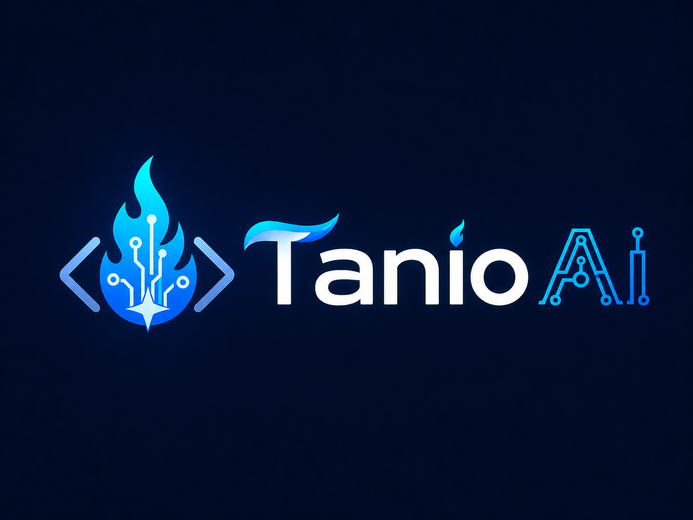

# Tanio AI

## Introduction

Tanio AI is an AI-powered workspace platform designed to help creators, developers, entrepreneurs, and tabletop RPG enthusiasts generate, organize, and manage content in one place.

The platform combines powerful AI-assisted planning tools with an intuitive workspace system, allowing users to create projects, organize content, collaborate with others, and export their work.

Tanio AI consists of two primary modules:

- **Product Architect** – AI-assisted product planning and software development documentation.
- **Tabletop Creator** – AI-powered tools for creating tabletop RPG campaigns, NPCs, quests, world-building content, and more.

The goal of Tanio AI is to reduce the time spent on planning and organization while helping users create high-quality content using artificial intelligence.

---

# ✨ Alpha Features

The following features are planned for the Alpha release of Tanio AI.

## Product Architect

Generate AI-powered project planning content including:

- Product Requirements Documents (PRDs)
- User Personas
- User Stories
- Feature Lists
- Technical Roadmaps
- Development Plans
- SWOT Analysis
- Market Research
- AI-generated project planning using the OpenAI API

## Tabletop Creator

Generate tabletop RPG content including:

- NPCs
- Characters
- Quests
- Encounters
- Locations
- World Building
- Magic Items
- Session Summaries

## Workspace Management

- Multiple Workspaces
- Project Organization
- AI Content History
- Content Versioning
- Export to PDF, DOCX, and TXT
- Project Sharing (planned)

---

# 🛠 Technologies

## Frontend

- React
- React Router
- Tailwind CSS
- Vite
- React Icons

## Backend

- FastAPI
- SQLAlchemy
- Pydantic
- JWT Authentication

## Database

- PostgreSQL

## AI

- OpenAI API

---

# 📂 Project Structure

```text
tanio-ai/
│
├── frontend/
│   ├── src/
│   │   ├── assets/
│   │   ├── components/
│   │   ├── pages/
│   │   ├── App.jsx
│   │   └── main.jsx
│   │
│   └── package.json
│
├── backend/
│   ├── app/
│   │   ├── api/
│   │   ├── core/
│   │   ├── db/
│   │   ├── models/
│   │   ├── schemas/
│   │   └── main.py
│   │
│   └── requirements.txt
│
└── README.md
```

---

# 🚀 Installation

## Clone the repository

```bash
git clone https://github.com/albertolawant/fullsail_capstone_project
```

```bash
cd fullsail_capstone_project
```

Before running the application, create a `.env` file in the backend directory and add your required environment variables, including your OpenAI API key, database credentials, and JWT secret.

---

## Backend Setup

Create a virtual environment

```bash
python -m venv .venv
```

Activate it.

### Windows

```bash
.venv\Scripts\activate
```

### macOS/Linux

```bash
source .venv/bin/activate
```

Install dependencies

```bash
pip install -r backend/requirements.txt
```

Run the backend

```bash
uvicorn app.main:app --reload
```

---

## Frontend Setup

Navigate to the frontend

```bash
cd frontend
```

Install dependencies

```bash
npm install
```

Start the development server

```bash
npm run dev
```

---

# 💻 Development Setup

To contribute to Tanio AI, install the following software:

- Git
- Python 3.12+
- Node.js 20+
- npm
- PostgreSQL
- Visual Studio Code (recommended)

Developers must create a `.env` file inside the backend directory to store sensitive configuration values.

Example:

```env
OPENAI_API_KEY=your_openai_api_key
DATABASE_URL=your_database_url
SECRET_KEY=your_secret_key
ALGORITHM=HS256
ACCESS_TOKEN_EXPIRE_MINUTES=30
```

The frontend and backend are developed independently. Start the FastAPI backend first, then launch the React frontend.

---

# 🌳 Git Workflow

This project follows a Git Flow workflow.

```text
main
│
develop
│
feature/*
```

Development process:

1. Create a feature branch from `develop`
2. Build the feature
3. Commit your changes
4. Merge into `develop`
5. Merge `develop` into `main` for stable releases

Example:

```bash
git checkout develop
git checkout -b feature/frontend-ui
```

---

# 📈 Project Status

Tanio AI is currently in the **Alpha** stage of development.

## ✅ Completed

- Backend project structure
- Frontend project structure
- Dashboard UI skeleton
- Sidebar navigation
- React Router integration
- Reusable React components
- Workspace routing
- Project routing
- Content routing
- Settings routing

## 🚧 In Progress

- Authentication
- Database integration
- Workspace CRUD
- Project CRUD
- OpenAI integration

## 📅 Planned

- Collaboration
- Version History
- Export System
- Analytics Dashboard
- AI Prompt History

---

# 👥 Contributors

## Alberto Lawant

- Backend Development
- AI Integration
- Database Design
- Frontend Development

## Byron Guntle

- Frontend Development
- UI/UX Design
- Figma Prototyping
- Documentation

---

# 📄 License

This project is being developed as part of the Full Sail University Computer Science Capstone.

This repository is licensed under the **MIT License**.

See the `LICENSE` file for more information.