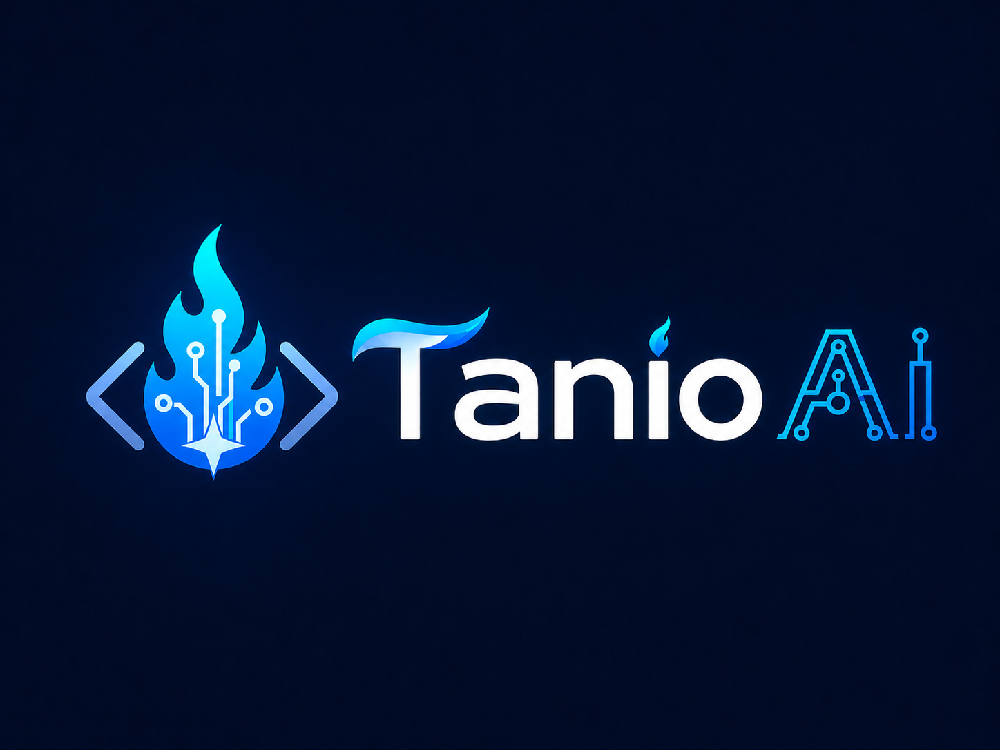

# Tanio AI

## Introduction

Tanio AI is an AI-powered workspace platform designed to help creators, developers, entrepreneurs, and tabletop RPG enthusiasts generate, organize, and manage AI-generated content in one place.

The platform combines intelligent planning tools with an intuitive workspace system, allowing users to organize projects, generate content, manage workspaces, export documents, and customize their AI experience.

Tanio AI currently consists of two primary modules:

- **Product Architect** – AI-assisted product planning and software development documentation.
- **Tabletop Creator** – AI-powered tools for building tabletop RPG campaigns, NPCs, quests, encounters, locations, and world-building content.

The goal of Tanio AI is to reduce the time spent planning and organizing projects while helping users create high-quality content using artificial intelligence.

---

# 🚀 Beta Features

Tanio AI has entered the **Beta** stage of development.

The core platform is now functional, with development focused on expanding features, improving usability, and preparing for user testing.

---

# ✨ Completed Features

## Platform

- User Registration
- User Login
- JWT Authentication
- Dashboard
- Workspace Management
- Project Management
- Content Library
- User Settings
- Activity Tracking
- Responsive Interface
- Dark Theme UI

---

## Product Architect

Generate AI-powered software planning documents including:

- Product Requirements Documents (PRDs)
- User Personas
- User Stories
- Feature Lists
- Technical Architecture

---

## Tabletop Creator

Generate tabletop RPG content including:

- Campaigns
- NPCs
- Quests
- Encounters
- Locations

---

## AI Features

- OpenAI Integration
- AI-powered document generation
- Persistent AI Preferences
- Adjustable Creativity
- Response Length Settings
- Tone Selection

---

## Content Management

- Organized Content Library
- Workspace Organization
- Project Organization
- Content Version Support
- Markdown Rendering

---

## Exporting

- Export to PDF
- Export to Markdown
- Export to TXT

---

# 🎯 Beta Development Goals

The following features will be completed during the Beta phase before user testing:

- Shared Project Collaboration
- Workspace Permissions
- AI Content Version History
- Dashboard Analytics
- AI Usage History
- Improved Export Options
- Performance Optimization
- UI Polish
- Accessibility Improvements
- Bug Fixes
- Deployment Preparation

---

# 🛠 Technologies

## Frontend

- React
- React Router
- Tailwind CSS
- Vite
- React Icons

## Backend

- FastAPI
- SQLAlchemy
- Pydantic
- JWT Authentication

## Database

- PostgreSQL

## AI

- OpenAI API

---

# 📂 Project Structure

```text
tanio-ai/
│
├── frontend/
│   ├── src/
│   │   ├── assets/
│   │   ├── components/
│   │   ├── pages/
│   │   ├── utils/
│   │   ├── App.jsx
│   │   └── main.jsx
│   │
│   └── package.json
│
├── backend/
│   ├── app/
│   │   ├── api/
│   │   ├── core/
│   │   ├── db/
│   │   ├── models/
│   │   ├── schemas/
│   │   └── main.py
│   │
│   └── requirements.txt
│
└── README.md
```

---

# 🚀 Installation

## Clone the repository

```bash
git clone https://github.com/albertolawant/fullsail_capstone_project
```

```bash
cd fullsail_capstone_project
```

Create a `.env` file inside the `backend` directory and add your environment variables before running the application.

---

## Backend Setup

Create a virtual environment

```bash
python -m venv .venv
```

Activate it.

### Windows

```bash
.venv\Scripts\activate
```

### macOS/Linux

```bash
source .venv/bin/activate
```

Install dependencies

```bash
pip install -r backend/requirements.txt
```

Run the backend

```bash
uvicorn app.main:app --reload
```

---

## Frontend Setup

Navigate to the frontend

```bash
cd frontend
```

Install dependencies

```bash
npm install
```

Run the development server

```bash
npm run dev
```

---

# 💻 Development Setup

Required software:

- Git
- Python 3.12+
- Node.js 20+
- npm
- PostgreSQL
- Visual Studio Code (recommended)

Create a `.env` file inside the backend directory.

Example:

```env
OPENAI_API_KEY=your_openai_api_key
DATABASE_URL=your_database_url
SECRET_KEY=your_secret_key
ALGORITHM=HS256
ACCESS_TOKEN_EXPIRE_MINUTES=30
```

Start the FastAPI backend before launching the React frontend.

---

# 🌳 Git Workflow

Tanio AI follows a Git Flow workflow.

```text
main
│
develop
│
feature/*
```

Development workflow:

1. Create a feature branch from `develop`
2. Implement the feature
3. Commit your changes
4. Merge into `develop`
5. Merge `develop` into `main` for stable releases

Example:

```bash
git checkout develop
git checkout -b feature/new-feature
```

---

# 📈 Project Status

**Development Stage:** **Beta**

## ✅ Completed

- User Authentication
- Dashboard
- Workspace Management
- Project Management
- Content Library
- Product Architect
- Tabletop Creator
- OpenAI Integration
- Export System
- User Settings
- AI Preference System
- Activity Tracking
- Responsive User Interface

---

## 🚧 Current Beta Focus

- Collaboration Features
- Workspace Permissions
- AI Version History
- Dashboard Analytics
- Performance Improvements
- UI Polish
- Accessibility
- User Testing Preparation

---

## 📅 Planned

- Team Collaboration
- Shared Workspaces
- Advanced Analytics
- AI Prompt History
- Additional AI Tools

---

# 👥 Contributors

## Alberto Lawant

- Backend Development
- Frontend Development
- AI Integration
- Database Design
- API Development

## Byron Guntle

- Frontend Development
- UI/UX Design
- Figma Prototyping
- Documentation

---

# 📄 License

Tanio AI is being developed as part of the Full Sail University Computer Science Capstone.

This project is licensed under the **MIT License**.

See the `LICENSE` file for more information.